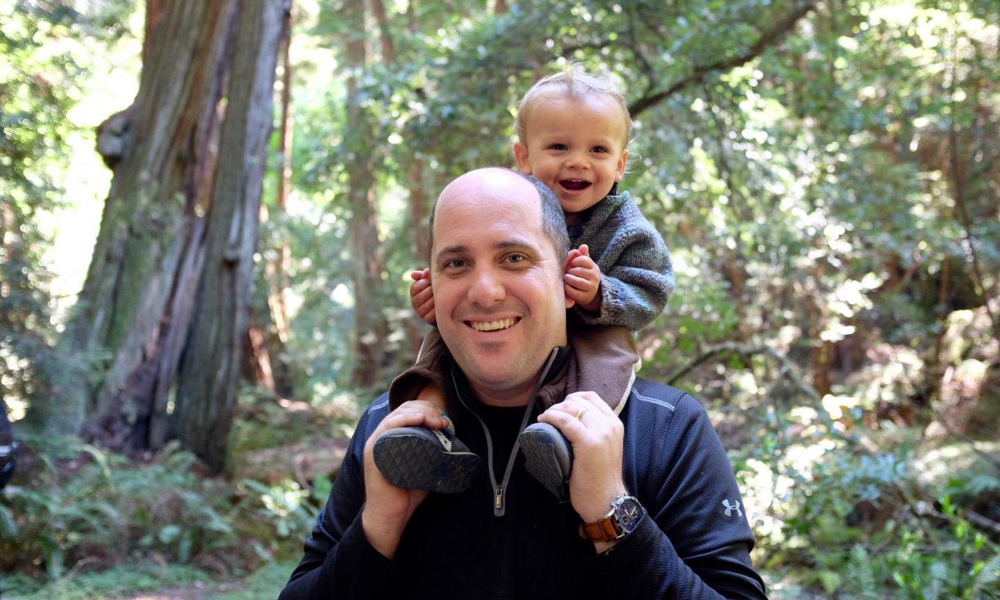

¡Bienvenidos!

My name is Ed, and I'm a doctoral candidate in applied economics at UC Berkeley. Specifically, I'm interested in the environment and natural resources, inequality, health, and development. I'm also interested in rural communities and agriculture, drug and criminal policies, and general empirical policy analysis. I'm a lover of data, graphs, maps, Venn diagrams, and people. I'm an avid consumer of pizza, pho, tacos, coffee, and computational power. I'm also a bunch of other things.

Please look around.

