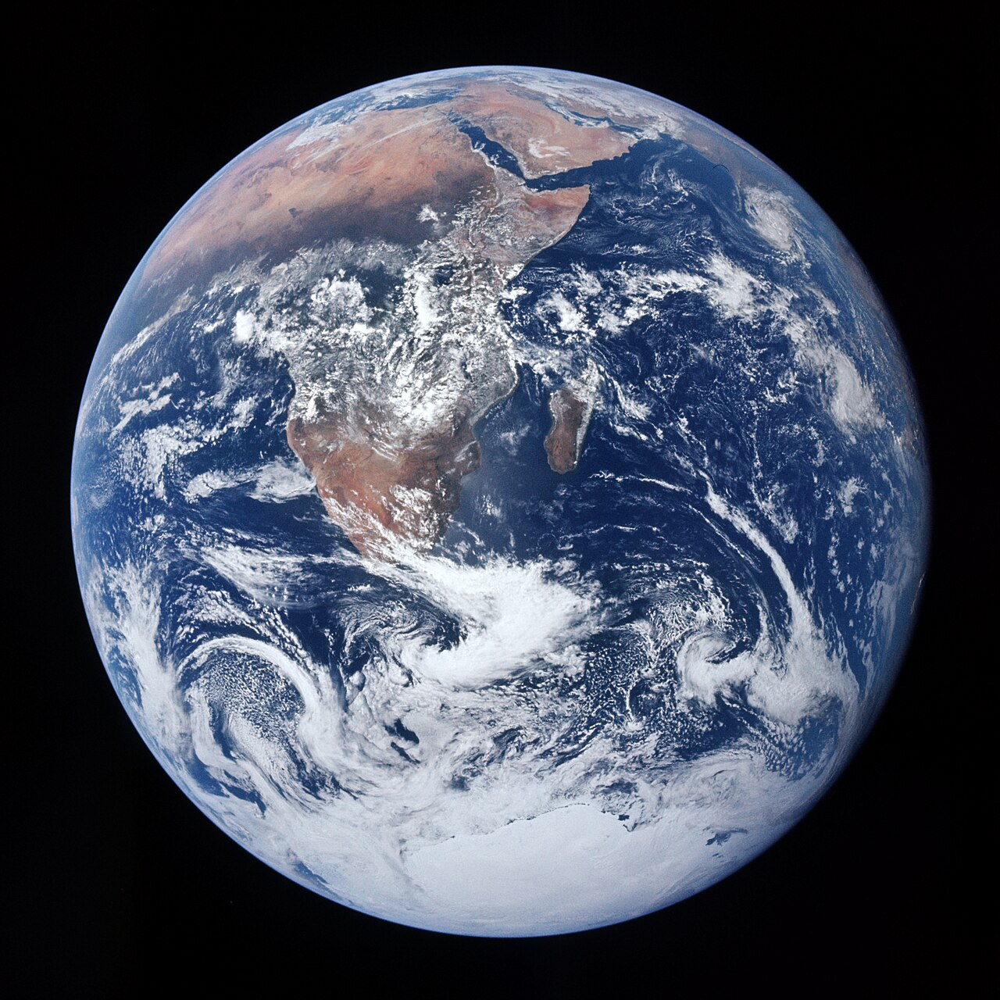

## {.middle}

[First, a little history]{.slab}

## How time flies

Donaldson and Storeygard (2016, _i.e._, 10 years ago!):

> [This research agenda for economists and other social scientists based on remote sensing data has made great strides in the last decade, but it seems safe to say that the real excitement lies ahead.]{.small}

Interesting historical note:

_Measuring Economic Growth from Outer Space_ from Henderson, Storeygard, and Weil (2012, AER) came out almost 15 years ago!^[Chen & Nordhaus (2011, PNAS) came out around the same time.]

##

However, **50 years ago**, Thomas Croft (1978, Scientific American) wrote about observing population, anthropogenic lights, gas flaring, agricultural fires, and wildfires in the USAF Defense Meteorological Satellite Program (DMSP) and Landsat 1.

> [At first the pictures that were relayed electronically back to the earth for this purpose were routinely discarded after a day's use, but the waste of potential scientific data was soon recognized and steps were taken to save the better auroral images.]{.small}

Twenty years later (and 25+ years ago), Elvidge _et al._ (1997, IJoRS) showed light emissions (via DMSP-OLS^[Defense Meteorological Satellite Program Operational Linescan System]) strongly correlated with GDP and electric power consumption.

## {.center}

![[**Gas flaring in _Landsat 1_**, Clark (1978)]{.smallest}](images/history/clark-1978-landsat.png){width=100% .centered}

## {.center}

![[**Cutting-edge computing in 1978**, advertisement in Clark 1978 article]{.smallest}](images/history/clark-1978-ad.png){width=100% .centered}

## {background-color="black"}

[[Around the same time:]{.it} Harrison Schmitt took _The Blue Marble_ from Apollo 17.]{.smallest}

{fig-align='right',}
