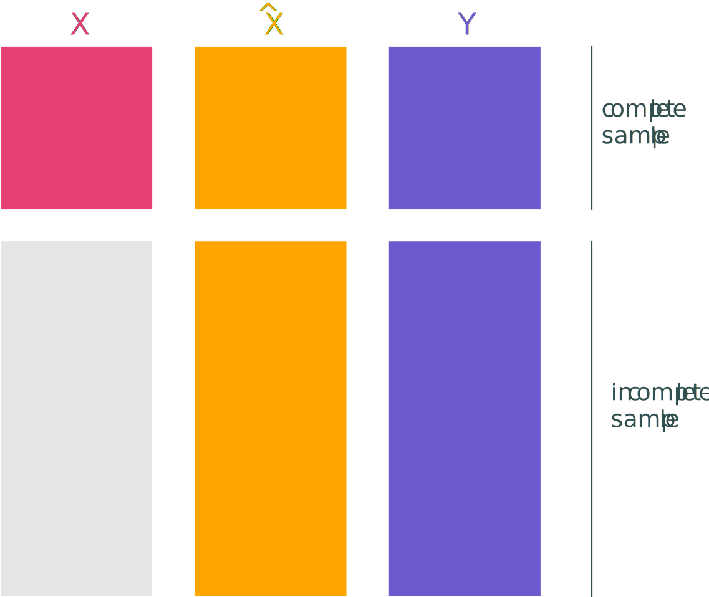

```{r}
#| label: setup
#| echo: false
#| warning: false
#| message: false

# Packages
library(pacman)
p_load(fastverse, stringr, ggplot2, magick, scales, viridis, here)
# Colors
co_pink = '#e64173'
co_slate = '#314f4f'
co_purple = '#6a5acd'
co_orange = '#ffa500'
co_grey_mid = '#7f7f7f'
co_grey_ml = '#cccccc'
co_grey_light = '#d2d2d2'
co_grey_vlight = '#e5e5e5'
```

## When is seeing believing?
### Motivating example: Pollution levels

![[**Fine particulate matter (PM~2.5~) predictions** for July 2002 from four research groups (at 1 km^2^)]{.smallest}](images/error/discrepancies/pm-200207.gif){width=100%}

## When is seeing believing?
### Motivating example: Pollution damages

```{r}
#| label: load-mortality-data
#| echo: false
#| include: false

# Define label levels
pm_labels =
  c('EPA', 'Di', 'Dickinson', 'van Donkelaar NA', 'van Donkelaar global', 'Wei')
# Load mortality estimates
mort_dt = here('data', 'cardio-poisson.csv') |> fread()
# Make label ordered factor
mort_dt[, `:=`(
  label = factor(
    label,
    levels = pm_labels,
    labels = pm_labels
  )
)]

# Load PTD mortality estimates
mort_ptd = here('data', 'cardio-poisson-ptd.csv') |> fread()
# Make label ordered factor
mort_ptd[, `:=`(
  label = factor(
    label,
    levels = pm_labels,
    labels = pm_labels
  )
)]

# Bind mort_dt and mort_ptd
mort_stack =
  rbindlist(
    list(mort_dt, mort_ptd),
    fill = TRUE,
    use.names = TRUE,
    idcol = 'source'
  )
mort_stack[, `:=`(
  source = factor(source, levels = 1:2, labels = c('Naive', 'PTD'))
)]
```

```{r}
#| echo: false
#| fig-height: 5
#| fig-width: 10
#| dpi: 300
#| cache: true
#| fig-cap: "[**Implied cardio. mortality from PM~2.5~** [from EPA monitors and four separate research groups (pct. increase in cardio. mortality from 1 µg/m^3^)]{.thin}]{.smallest}"

# Plot
ggplot(
  data = mort_dt[sample != 'full' & str_detect(label, 'global', negate = TRUE)],
  aes(
    x = label,
    y = exp_est,
    ymin = exp_ci_l,
    ymax = exp_ci_u,
    color = label,
    alpha = sample
  )
) +
  geom_hline(yintercept = 0, linewidth = .25) +
  geom_pointrange(linewidth = 1) +
  labs(
    x = '',
    y = 'Estimated mortality increase'
  ) +
  scale_y_continuous(labels = label_percent()) +
  scale_color_viridis(
    discrete = TRUE,
    begin = 0,
    end = 0.8,
    option = 'magma'
  ) +
  scale_alpha_manual('', values = c(1, 0)) +
  theme_minimal(
    base_size = 16,
    base_family = 'Sarabun',
    ink = co_slate
  ) +
  theme(legend.position = 'none')
```

## When is seeing believing?
### Motivating example: Pollution damages

```{r}
#| echo: false
#| fig-height: 5
#| fig-width: 10
#| dpi: 300
#| cache: true
#| fig-cap: "[**Estimated damages change farther from ground-truth data**[, complicating our inferences]{.thin}]{.smallest}"

# Plot
ggplot(
  data = mort_dt[sample != 'full' & str_detect(label, 'global', negate = TRUE)],
  aes(
    x = label,
    y = exp_est,
    ymin = exp_ci_l,
    ymax = exp_ci_u,
    color = label,
    alpha = sample
  )
) +
  geom_hline(yintercept = 0, linewidth = .25) +
  geom_pointrange(linewidth = 1) +
  labs(
    x = '',
    y = 'Estimated mortality increase'
  ) +
  scale_y_continuous(labels = label_percent()) +
  scale_color_viridis(
    discrete = TRUE,
    begin = 0,
    end = 0.8,
    option = 'magma'
  ) +
  scale_alpha_manual('', values = c(.1, 1)) +
  theme_minimal(
    base_size = 16,
    base_family = 'Sarabun',
    ink = co_slate
  ) +
  theme(legend.position = 'none')
```

## Remote sensing + environmental economics
### Changes

:::: {.columns}
::: {.column width='45%'}

Remote sensing^[I'll focus on satellite-based <br> remote sensing.)] is changing the way we "do" enviro. economics

- [what]{.it .purple} we can measure,
- [where/when]{.it .purple} we can measure it,
- [how]{.it .purple}^[to a less-appreciated extent] we measure it.

:::

::: {.column width='55%'}
![[**Deforestation and development** [near Yurimaguas, Peru, 2001 _vs._ 2019]{.thin}]{.smallest}](images/ex-applications/deforestation/yurimaguas-oli-2019191.webp){width=100%}
:::

::::

## The promise

:::: {.columns}
::: {.column width='60%'}
### Learning from new measurements

Remote sensing has helped solve <br> first-order [measurement problems]{.pink}

1. [[out-of-reach]{.it} variables]{},
1. in [inaccessible]{.it} areas,
1. with immense [spatiotemporal coverage]{.it},^[often with relatively high resolution]
1. validating potentially manipulated data.
:::

::: {.column width='40%'}
{width=100%}
{width=100% style="margin-top: -0.5em;"}

<figcaption>[**Increasing coverage.** [PM~2.5~ reg. monitors _vs._ predictions]{.thin}]{.tiny}</figcaption>
:::
::::

## The challenge
### Errors, uncertainty, and causal inference.

![[**Where's the forest? Disagreement in _forest cover_ across eight remote-sensing products**, Castle _et al._ (2026)]{.smallest}](images/error/castle-et-al-2025-global.jpg){width=100% .center}

## {.center}

![[**Disagreement in _biomass_ between 2 remote-sensing products** for Kenya (ESRI _vs._ ESA), Castle _et al._ (2026)]{.smallest}](images/error/castle-et-al-2025-kenya.png){width=100% .center}

## My thesis

[Measurement has improved.]{.b .pink .semi-fade-out .fragment fragment-index=2} [Critical questions remain.]{.fragment .b .purple fragment-index=2}

::: {.fragment fragment-index=2}
- [ ] How much should we [trust]{.it .purple} remote-sensing measurements? <br> [(Errors may be larger and more structured than expected.)]{.grey-light .it}
- [ ] How do we [_fix_ causal inf.]{.purple} when using remotely sensed data? <br> [(Some promising directions; can rely on infeasible data.)]{.grey-light .it}
- [ ] How do we address [endogenous _ground-truth_]{.purple} infrastructure? <br> [(Bias and lack of generalization; more work needed.)]{.grey-light .it}
- [ ] How do we address [strategic responses]{.purple}? <br> [(The cat-and-mouse game continues...)]{.grey-light .it}
- [ ] What roles do/can [_conventional_ data]{.purple} play in remote sensing? <br> [(Very large roles!)]{.grey-light .it}
:::

[(Reminds me of current conversations around AI/LLMs.)]{.fragment fragment-index=3 .grey-light .it}

## Today
### Overview

Overall, I hope to provide a 10,000-foot picture of

- [what's working:]{.note} what we're learning from remote sensing projects;
- [what's not working:]{.note} concerns with current approaches, promising paths forward, and room for future innovation;
- [a false dilemma:]{.note} roles for remote sensing data _and_ "conventional" data.

## {.middle}

[_Where_ is remote sensing offering new insights?]{.slab}
<br>
[Everywhere.]{.grey-vlight}

## Remote sensing
### Examples
Just a _few_ examples of recent applications

[↳]{.slab .grey-light} [Measuring environmental quality]{.b}
<br>[↳]{.slab .white} [air/water/soil quality, weather/climate, groundwater, invasive species]{.it .grey-light}

## {.center}

![[**Global, daily 1 km^2^ PM~2.5~**, Wei _et al._ (2023)]{.smallest}](images/ex-applications/air-quality/wei-2023.webp){width=100%}

## {.center}

![[**Seawater alkalinity**, Land et al. (2015) and ESA]{.smallest}](images/ex-applications/water/land-et-al-2015.jpg){width=100% .center}

## {.center}

![[**Land and sea surface temperatures**, ESA]{.smallest}](images/ex-applications/climate/esa-surface-temp.jpg){width=100% .center}

## {.center}

![[**Shallow-groundwater drought indicator**, NASA JPL GRACE]{.smallest}](images/ex-applications/water/grace-drought-indicator){width=100% .center}

## Remote sensing
### Examples—and why they matter
Just a _few_ examples of recent applications

::: {.lt}
[↳]{.slab .grey-light} [Measuring environmental quality]{.b}
<br>[↳]{.slab .white} [air/water/soil quality, weather/climate, groundwater, invasive species]{.it .grey-light}
:::

::: {}
[↳]{.slab .grey-light} [Measuring land/*resource* use, land cover, and development]{.b}
<br>[↳]{.slab .white} [nighttime lights, urban growth, land cover (change), wealth estimates]{.it .grey-light}
:::

## {.center}

![[**Change in nighttime lights** in Europe, 1992–2010, ESA]{.smallest}](images/ex-applications/nightlights/esa-europe-1992-2010.gif){width=100% .center}

## {.center}

![[**Forest loss from gold mining** in Ghana, Barenblitt _et al._ (2021)]{.smallest}](images/ex-applications/mining/barenblitt-et-al-2021.jpg){width=100% .center}

## {.center}

![[**Fishing intensity** around Italy, Global Fishing Watch]{.smallest}](images/ex-applications/fishing/gfw-italy.jpg){width=100% .center}

## Remote sensing {auto-animate=true}
### Examples—and why they matter
Just a _few_ examples of recent applications

::: {.lt}
[↳]{.slab .grey-light} [Measuring environmental quality]{.b}
<br>[↳]{.slab .white} [air/water/soil quality, weather/climate, groundwater, invasive species]{.it .grey-light}
:::

::: {.lt}
[↳]{.slab .grey-light} [Measuring land/*resource* use, land cover, and development]{.b}
<br>[↳]{.slab .white} [nighttime lights, urban growth, land cover (change), wealth estimates]{.it .grey-light}
:::

[↳]{.slab .grey-light} [Auditing behavior]{.b}
<br>[↳]{.slab .white} [mining, deforestation, fishing, land-use, even _in situ_ monitoring]{.it .grey-light}

## {.center}

![[**Methane emissions** near Tehran, Iran, NASA EMIT (2022)]{.smallest}](images/ex-applications/air-quality/nasa-methane-iran.webp){width=100% .center}

## {.center}

![[**Illegal Cannabis farms**, LA Times (2022)]{.smallest}](images/ex-applications/cannabis/la-times.webp){width=100% .center}

## {.center}

![[**Spatiotemporal footprints of artisanal gold mining** in protected forest in Indonesia, Lukman (2025)]{.smallest}](images/ex-applications/mining/lukman.gif){width=100% .center}

## {.center}

![[**The "Dark Fleet"**, Global Fishing Watch and untracked fishing vessels <br>[(A new application of "nighttime lights"!)]{.grey-light}]{.smallest}](images/ex-applications/fishing/gfw-global-dark.gif){width=100% .center}

## Remote sensing
### Examples—and why they matter
Just a _few_ examples of recent applications

::: {.lt}
[↳]{.slab .grey-light} [Measuring environmental quality]{.b}
<br>[↳]{.slab .white} [air/water/soil quality, weather/climate, groundwater, invasive species]{.it .grey-light}
:::

::: {.lt}
[↳]{.slab .grey-light} [Measuring land/*resource* use, land cover, and development]{.b}
<br>[↳]{.slab .white} [nighttime lights, urban growth, land cover (change), wealth estimates]{.it .grey-light}
:::

::: {.lt}
[↳]{.slab .grey-light} [Auditing behavior]{.b}
<br>[↳]{.slab .white} [mining, deforestation, fishing, land-use, even _in situ_ monitoring]{.it .grey-light}
:::

[↳]{.slab .grey-light} [Natural disasters]{.b}
<br>[↳]{.slab .white} [smoke plumes, wildfires, flood damage, hurricane impacts]{.it .grey-light}

## {.center}

![[**Detecting earthquake damage** in Islahiye, Turkey with xView2]{.smallest}](images/ex-applications/disasters/xview-earthquake.webp){width=100% .center}

## {.center}

![[**Detecting flood extents** in Australia and Pakistan, Portalés-Julià _et al._ (2023)]{.smallest}](images/ex-applications/disasters/portales-julia-et-al-2023.webp){width=100% .center}

## {.center}

<center>
<video data-autoplay muted playsinline loop controls style="width: 100%; height: 100%; object-fit: contain;">
  <source src="images/ex-applications/disasters/goes-fp-cobbna-nam-jun2023_1080p30.mp4" type="video/mp4">
</video>
</center>
![[**CO emissions from Canadian wildfires**, June 2023 (NASA)]{.smallest}](){}

## {.middle}

[Remote sensing has been around a little while...]{.slab}

## {.center}

![[**Nighttime lights in the 1970s**, Clark (1978)]{.smallest}](images/history/clark-1978-nightlights.png){width=100% .centered}

## {.center}

![[**Population in the 1970s**, Clark (1978)]{.smallest}](images/history/clark-1978-population.png){width=100% .centered}

## {.center}

![[_Early measurement challenges:_ **_Development_ or _gas flaring_?** Landsat 1, Clark (1978)]{.smallest}](images/history/clark-1978-landsat.png){width=100% .centered}

## {.center}

![[_Even earlier:_ **US gov't surveyed 90+% of agricultural land** via aerial photography 1938--1947]{.smallest}](images/history/aerial-hardin-1938.png){width=100%}

::: {.fragment .absolute style="left: 42%; top: 41%; width: 27%; height: 23%; border: 3px solid orange; pointer-events: none;"}
:::

## {.center}

![[_Even earlier:_ **US gov't surveyed 90+% of agricultural land** via aerial photography 1938--1947]{.smallest}](images/history/aerial-hardin-1938-zoom.png){width=100% .centered}

## {.center}

![[**... and now today** (*here:* Google Earth)]{.smallest}](images/history/google-hardin-2026.png){width=100% .centered}

::: {.fragment .absolute style="left: 79%; top: 30%; width: 20%; height: 20%; border: 3px solid orange; pointer-events: none;"}
:::

## {.center}

![[**A bit closer yet** (still Google Earth)]{.smallest}](images/history/google-hardin-2026-zoom-2.png){width=100% .centered}

## {.center}

![[**How good is good enough?** [Satellite-based detection of mines,]{.red} Maus _et al._ (2022) and GRU]{.smallest}](images/history/google-hardin-2026-zoom-2-poly.png){width=100% .centered}

## {.center}

![[*Zooming back out:* **How good is good enough?** Global mining area added between v1 (2020) and v2 (2022) of Maus _et al._]{.smallest}](images/ex-applications/mining/maus-et-al-2022.webp){width=100% .centered}

## The challenges
### What's next

Remote sensing

- makes [**big contributions** for measurement]{.pink} and holds a lot of promise;^[And if you're like me, you like shiny, new things.]

- presents [new **measurement challenges**]{.purple} for environmental economics.

::: {.fragment}
Donaldson and Storeygard (2016):

> [Overall, it is essential for economists using remote sensing data to understand, and be skeptical of, the data and assumptions underlying them.]{.small}
:::

[We still need to think about selection/endogeneity, mismeasurement, strategic responses, validation data, ...]{.fragment}

## When is seeing believing?
### Measurement and mismeasurement

[_Measurement error_ is not new]{.b} to economics (or statistics).^[[_Early stat. work:_ Adcock (1877/8); Kummell (1879); Gini (1921);<br> _Early econ. work:_ Frisch (1934); Koopmans (1937); Wald (1940); Haavelmo (1944); Reiersøl (1950); Durbin (1954)]{.small}]

Yet, remote sensing (RS) adds new elements to consider.

::: {.incremental}

- most RS data are [processed]{.b .purple}; [(raw data present their own challenges);]{.grey-light}
- RS products are _often_ [predictions]{.b .purple} from models that combine satellite imagery with other features;
- training/validation data are typically from [selected/endogenous samples]{.b .purple};
- actors may [strategically respond]{.b .purple} to RS data (and its errors).
:::

[⇒ [concerns]{.b} for identification, inference, _and_ application.]{.fragment}


## Challenge #1: Measurement error
### $\hat{x}$ vs. $x$

[Remotely sensed variables have [error]{.purple}.]{.b}

Current lit _might_ acknowledge this issue—but rarely addresses it.

- data products created [[without]{.b} causal inference]{.it .purple} in mind;
- likely [not]{.b .purple} [classical]{.it .purple} measurement error;
- ⇒ [biased]{.b .purple} point estimates and/or inference;

::: {.fragment}
[Potential]{.it} solutions:^[Of course, with _caveats_.]

- training/validation should match use case;
- use ground-truth/validation data to _debias_ causal inference.
:::

## {.center}

Donaldson and Storeygard (2016)

> [... it is important to recognize that the types of errors that would seriously jeopardize a typical economic application of remotely sensed data are not always a main concern of the remote sensing community.]{.small}

## Measurement error refresh
### Setup

[Observed value]{.purple} differs from the [true value]{.pink} due to some [measurement error]{.orange}
$$\textcolor{#6a5acd}{x_\text{obs}} = \textcolor{#ffa500}{\alpha_0} + \textcolor{#ffa500}{\alpha_1} \textcolor{#e64173}{x_\text{true}} + \textcolor{#ffa500}{\epsilon}$$

## Measurement error refresh {visibility="uncounted"}
### Setup

[Observed value]{.purple} differs from the [true value]{.pink} due to some [measurement error]{.orange}
$$\textcolor{#6a5acd}{x_\text{obs}} = \textcolor{#ffa50040}{\alpha_0} \textcolor{#0000001A}{+} \textcolor{#ffa50040}{\alpha_1} \textcolor{#e64173}{x_\text{true}} + \textcolor{#ffa500}{\epsilon}$$

Papers frequently invoke _attenuation bias_ from [classical measurement error]{.note}

- $\textcolor{#6a5acd}{x_\text{obs}}$ is an unbiased^[$\textcolor{#ffa500}{\alpha_0} = 0$; $\textcolor{#ffa500}{\alpha_1} = 1$; $E[\textcolor{#ffa500}{\epsilon}] = 0$; and often $\textcolor{#ffa500}{\epsilon}$ has a constant variance.] estimate of $\textcolor{#e64173}{x_\text{true}}$,
- $\textcolor{#ffa500}{\epsilon}$ is independent of $\textcolor{#e64173}{x_\text{true}}$,
- $\textcolor{#ffa500}{\epsilon}$ is independent of any other variables of interest (outcomes or regressors).

[Unfortunately, RS likely generates [non-classical measurement error]{.slab .it .orange}.]{.fragment}

## {.center}

```{r}
#| cache: true
#| fig-cap: "[_Mean-reverting measurement error:_ **Monitored PM~2.5~ _vs._ predictions from Di _et al._ (2016)**, Fowlie, Rubin, and Walker (2019)]{.smallest}"

here('images/error/fowlie-rubin-walker/box_monitor_di_all_years.png') |>
  image_read() |>
  image_chop('0x100') |>
  image_trim()
```

## {.center}

```{r}
#| cache: true
#| fig-cap: "[_Mean-reverting measurement error:_ **Monitored PM~2.5~ _vs._ predictions (NA) from vD _et al._ (2019)**, Fowlie, Rubin, and Walker (2019)]{.smallest}"

here('images/error/fowlie-rubin-walker/box_monitor_vdna_all_years.png') |>
  image_read() |>
  image_chop('0x100') |>
  image_trim()
```

## {.center}

```{r}
#| cache: true
#| fig-cap: "[_Mean-reverting measurement error:_ **Monitored PM~2.5~ _vs._ predictions [(Global)]{.purple} from vD _et al._ (2019)**, Fowlie, Rubin, and Walker (2019)]{.smallest}"

here('images/error/fowlie-rubin-walker/box_monitor_vdg_all_years.png') |>
  image_read() |>
  image_chop('0x100') |>
  image_trim()
```

## Measurement error
### In remotely sensed variables

If $\textcolor{#6a5acd}{x_\text{obs}}$ results from a prediction or calibration algorithm
<br>[_e.g._, pollution, income, temp.]{.grey-light}

- we often have [_mean-reverted_ predictions]{.purple},
- overpredicting low values and underpredicting high values,

$$\textcolor{#6a5acd}{x_\text{obs}} = \textcolor{#ffa500}{\alpha_0} \textcolor{#000000}{+} \textcolor{#ffa500}{\alpha_1} \textcolor{#e64173}{x_\text{true}} + \textcolor{#ffa500}{\epsilon}$$

where $\textcolor{#ffa500}{\alpha_0}  > 0$ and $0 < \textcolor{#ffa500}{\alpha_1} < 1$. [⇒ No guarantee of _attenuation bias_.^[Updating the way I teach econometrics..]]{.fragment}

[<br>[Categorical/binned variables face a similar problem:]{.note} Errors correlate with truth.]{.fragment}

## Measurement error {visibility="hidden"}
### In remotely sensed variables

If $\textcolor{#6a5acd}{x_\text{obs}}$ and $\textcolor{#e64173}{x_\text{true}}$ are both binary variables
<br>[_e.g._, landcover, deforestation, mine, temp. bin]{.grey-light}

| $\textcolor{#6a5acd}{x_\text{obs}}$ | $\textcolor{#e64173}{x_\text{true}}$ | $\textcolor{#ffa500}{\epsilon}$ |
|:---:|:---:|---:|
| $\textcolor{#6a5acd}{1}$ | $\textcolor{#e64173}{1}$ | $\textcolor{#ffa500}{0}$ |
| $\textcolor{#6a5acd}{1}$ | $\textcolor{#e64173}{0}$ | $\textcolor{#ffa500}{1}$ |
| $\textcolor{#6a5acd}{0}$ | $\textcolor{#e64173}{1}$ | $\textcolor{#ffa500}{-1}$ |
| $\textcolor{#6a5acd}{0}$ | $\textcolor{#e64173}{0}$ | $\textcolor{#ffa500}{0}$ |

$\implies \textcolor{#ffa500}{\epsilon}$ negatively correlates with $\textcolor{#e64173}{x_\text{true}}$.

## Measurement error
### In remotely sensed variables

Recent work highlights a more prevalent and pernicious type of measurement error^[Proctor, Carleton, and Sum (2026) call this type of measurement error [differential measurement error]{.it}.] common to remotely sensed variables.

[Differential measurement error]{.note}

::: {.centered}
$y = \beta_0 + \beta_1 \textcolor{#6a5acd}{x_\text{obs}} + \textcolor{#7cae96}{u} \quad\quad\quad$ [model of interest]{.grey-light .it}

$\textcolor{#6a5acd}{x_\text{obs}} = \textcolor{#ffa500}{\alpha_0} + \textcolor{#ffa500}{\alpha_1} \textcolor{#e64173}{x_\text{true}} + \textcolor{#ffa500}{\epsilon} \quad\quad\quad$ [measurement error]{.grey-light .it}
:::

and $\textcolor{#ffa500}{\epsilon}$ correlates with $\textcolor{#7cae96}{u}$.

_I.e._, error correlates with [other factors that correlate with the outcome]{.green}.[..<br>... endogenous measurement error.]{.fragment}

## {.center}

```{r}
#| label: load-county-meas-error
#| cache: true
#| echo: false

# Load county-agg monitor/PM predictions
co_dt =
  here('data', 'pm-county-epa-pred.csv') |>
  fread()
# To long
co_long =
  co_dt |>
  # Select relevant columns
  gv(c('fips', 'shr_epa', 'me_', 'pop', 'inc'), regex = TRUE) |>
  # Pivot to long format
  pivot(
    ids = c('fips', 'shr_epa', 'pop_total', 'pc_income'),
    how = 'longer',
  )
setnames(co_long, old = c('variable', 'value'), new = c('grp', 'me'))
co_long[, `:=`(
  grp = fcase(
    grp == 'me_di', 'Di',
    grp == 'me_wei', 'Wei',
    grp == 'me_wustl', 'vD NA',
    grp == 'me_wustlg', 'vD global',
    grp == 'me_dr_iid0', 'Dickinson, stnd. CV',
    grp == 'me_dr_spcv', 'Dickinson'
  )
)]
# Winsorize income
inc_h = co_long[, fnth(pc_income, .99)]
inc_l = co_long[, fnth(pc_income, .01)]
co_long[pc_income >= inc_h, pc_income := inc_h]
co_long[pc_income <= inc_l, pc_income := inc_l]
```

```{r}
#| fig-cap: "[_Differential measurement error:_ **Counties' mean pred. error for PM~2.5~ and population**, Di _et al._ (2019) and van Donkelaar _et al._ (2024)]{.smallest}"
#| fig-height: 6
#| fig-width: 10
#| dpi: 300
#| cache: true
#| echo: false

# Plot
ggplot(
  data = co_long[
    shr_epa >= .9 &
    (grp %in% c('vD NA', 'Di'))
  ],
  aes(
    x = pop_total,
    y = me,
    color = grp
  )
) +
  geom_hline(yintercept = 0, linewidth = .25) +
  geom_point(size = .2) +
  geom_smooth(
    linewidth = 2,
    method = 'lm',
    formula = y ~ splines::bs(x, 5),
    se = FALSE
  ) +
  scale_x_log10(labels = comma) +
  labs(
    x = expression('County population (log'[10] * ' scale)'),
    y = expression('Avg. measurement error, ' * italic('μg/m'^3)),
    color = 'Group'
  ) +
  scale_color_viridis(
    '',
    discrete = TRUE,
    option = 'magma',
    begin = .15,
    end = .65
  ) +
  theme_minimal(
    base_size = 14,
    base_family = 'Sarabun',
    ink = co_slate
  ) +
  theme(legend.position = 'bottom')
```

## {.center}

```{r}
#| fig-cap: "[_Differential measurement error:_ **Counties' mean pred. error for PM~2.5~ and income _pc_**, Di _et al._ (2019) and van Donkelaar _et al._ (2024)]{.smallest}"
#| fig-height: 6
#| fig-width: 10
#| dpi: 300
#| cache: true
#| echo: false

# Plot
ggplot(
  data = co_long[
    shr_epa >= .9 &
    (grp %in% c('vD NA', 'Di'))
  ],
  aes(
    x = pc_income,
    y = me,
    color = grp
  )
) +
  geom_hline(yintercept = 0, linewidth = .25) +
  geom_point(size = .2) +
  geom_smooth(
    linewidth = 2,
    method = 'lm',
    formula = y ~ splines::bs(x, 5),
    se = FALSE
  ) +
  scale_x_log10(labels = dollar) +
  labs(
    x = expression('County income per capita (log'[10] * ' scale)'),
    y = expression('Avg. measurement error, ' * italic('μg/m'^3)),
    color = 'Group'
  ) +
  scale_color_viridis(
    '',
    discrete = TRUE,
    option = 'magma',
    begin = .15,
    end = .65
  ) +
  theme_minimal(
    base_size = 14,
    base_family = 'Sarabun',
    ink = co_slate
  ) +
  theme(legend.position = 'bottom')
```

## {.middle}

[So what?]{.slab .slate}

## Measurement error
### So what?

[Promise]{.it .slab .pink} Remote sensing _can_ change <br> [what/how we understand the environment, economics, and policy]{.pink}.[..]{.fragment fragment-index=2}

::: {.fragment fragment-index=2}
[Concern]{.it .slab .purple} ...but, _non-classical_ measurement error may significantly <br> [impair our ability to learn]{.purple} _anything_ from RS data.
:::

::: {.fragment}
1. [point estimates:]{.b .purple} bias need not attenuate toward zero.^["Classic" papers in labor (Ashenfelter and Krueger, 1994) and crime (Chalfin and McCrary, 2016) also document measurement error bias as a first-order concern.]
2. [inference:]{.b .purple} confidence interval coverage can _plummet_.
:::

## {.center}

![[**Coef. bias and conf. interval coverage issues**, _adapted from_ Proctor, Carleton, and Sum (2026)]{.smallest}](images/bias/summary-proctor-carleton-sum.png){width=100% .center}

## Measurement error
### So what?

[Promise]{.it .slab .pink} Remote sensing _can_ change <br> [what/how we understand the environment, economics, and policy]{.pink}...

[Concern]{.it .slab .purple} ...but, _non-classical_ measurement error may significantly <br> [impair our ability to learn]{.purple} _anything_ from RS data.

1. [point estimates:]{.b .purple} bias need not attenuate toward zero.^["Classic" papers in labor (Ashenfelter and Krueger, 1994) and crime (Chalfin and McCrary, 2016) also document measurement error bias as a first-order concern.]
2. [inference:]{.b .purple} confidence interval coverage can _plummet_.
3. [heterogeneity:]{.b .purple} does het. reflect het. trt. effects or het. meas. error?
4. [policy ranking:]{.b .purple} maps differ on areas w/ highest damages, benefits, ...

## Measurement error
### Evidence so far

The problem is _not_ ["satellites are noisy."]{.note}

[The problem is that the _noise_ is structured in [economically meaningful ways.]{.note}]{.fragment}

::: {.fragment}
- [Systematic parameter bias]{.note}: Proctor, Carleton, and Sum show remotely sensed variables often fail to recover the target parameter.
- [Treatment-correlated error]{.note}: Alix-García and Millimet show forest measures can generate nonclassical bias in PES estimates.
- [Binning/classification error]{.note}: Carson and Yu; Wardle show discretization and misclassification can distort climate, crop, and land-use estimates.^[_Related:_ New work by Jones _et al._ on binning in climate-response estimation.]
:::

## {.middle}

[So what do we do?]{.slab .slate}

## Measurement error
### What fixes have in common

Emerging solutions generally share an architecture

:::: {.columns}
:::: {.column width='60%'}
{width=100% .center}
::::

:::: {.column width='40%' .smaller}

::: {.fragment fragment-index=1 .fade-in-then-out}
<br>
For small ground-truth sample:<br> we observe $\textcolor{#6a5acd}{\text{Y}}$ and $\textcolor{#e64173}{\text{X}}$.

Unbiased, high-variance estimates.
:::

::: {.fragment fragment-index=2 .fade-in}
<br><br>
For large RS sample:<br> we observe $\textcolor{#6a5acd}{\text{Y}}$ and $\textcolor{#ffa500}{\hat{\text{X}}}$

Biased, low-variance estimates.
:::

::::
::::

<!-- complete set, X -->
::: {.fragment fragment-index=1 .fade-in-then-out .absolute style="left: -2%; top: 25%; width: 16%; height: 28%; border: 3px solid #e64173; pointer-events: none;"}
:::

<!-- complete set, Y -->
::: {.fragment fragment-index=1 .fade-in-then-out .absolute style="left: 29%; top: 25%; width: 16%; height: 28%; border: 3px solid #6a5acd; pointer-events: none;"}
:::

<!-- incomplete set, X hat -->
::: {.fragment fragment-index=2 .absolute style="left: 14%; top: 53%; width: 14.8%; height: 47%; border: 3px solid #ffa500; pointer-events: none;"}
:::

<!-- incomplete set, Y -->
::: {.fragment fragment-index=2 .absolute style="left: 29.5%; top: 53%; width: 14.8%; height: 47%; border: 3px solid #6a5acd; pointer-events: none;"}
:::

<!-- full rectangle around complete set
::: {.absolute style="left: -2%; top: 25%; width: 60%; height: 28%; border: 0px solid #314f4f; pointer-events: none;"}
:::
-->

<!-- full rectangle around incomplete set
::: {.absolute style="left: -2%; top: 53%; width: 60%; height: 47%; border: 2px solid #314f4f; pointer-events: none;"}
:::
-->

## Measurement error {visibility="uncounted"}
### What fixes have in common

Emerging solutions generally share an architecture

:::: {.columns}
:::: {.column width='60%'}
{width=100% .center}
::::

:::: {.column width='40%' .smaller}

<br>
However, there's more to learn.

::: {.fragment fragment-index=1}
Comparing $\textcolor{#ffa500}{\hat{\text{X}}}$ to $\textcolor{#e64173}{\text{X}}$ reveals patterns in measurement error.

[E.g.,]{.note} Multiple imputation from Proctor, Carleton, and Sum
learns  $\textcolor{#e64173}{\text{X}} = f(\textcolor{#ffa500}{\hat{\text{X}}},\, \textcolor{#6a5acd}{\text{Y}})$, "correcting" $\textcolor{#ffa500}{\hat{\text{X}}}$.
:::

::: {.fragment fragment-index=2}
Sanford et al.'s _adversarial debiasing_ presents a somewhat related approach.
:::

::::
::::

<!-- full rectangle around complete set -->
::: {.fragment fragment-index=1 .fade-out .absolute style="left: -2%; top: 25%; width: 60%; height: 28%; border: 2px solid #314f4f; pointer-events: none;"}
:::

<!-- complete set, X -->
::: {.fragment fragment-index=1 .absolute style="left: -1.5%; top: 25%; width: 14.8%; height: 28%; border: 3px solid #e64173; pointer-events: none;"}
:::

<!-- complete set, X hat -->
::: {.fragment fragment-index=1 .absolute style="left: 14%; top: 25%; width: 14.8%; height: 28%; border: 3px solid #ffa500; pointer-events: none;"}
:::

## Measurement error {visibility="uncounted"}
### What fixes have in common

Emerging solutions generally share an architecture

:::: {.columns}
:::: {.column width='60%'}
{width=100% .center}
::::

:::: {.column width='40%' .smaller}
<br>
However, there's more to learn.

Comparing $\textcolor{#6a5acd}{\text{Y}} \sim \textcolor{#ffa500}{\hat{\text{X}}}$ to $\textcolor{#6a5acd}{\text{Y}} \sim \textcolor{#e64173}{\text{X}}$ reveals patterns in parameter-estimate bias.

[E.g.,]{.note} _prediction-powered-inference_ and _predict-then-debias_.
<br>[(Angelopoulos _et al._ and Kluger _et al._)]{.small .grey-vlight}

::::
::::

<!-- complete set, X hat -->
::: {.absolute style="left: 14%; top: 25%; width: 14.8%; height: 28%; border: 3px solid #ffa500; pointer-events: none;"}
:::

<!-- complete set, Y -->
::: {.absolute style="left: 29.5%; top: 25%; width: 14.8%; height: 28%; border: 3px solid #6a5acd; pointer-events: none;"}
:::

## Measurement error {visibility="uncounted"}
### What fixes have in common

Emerging solutions generally share an architecture

:::: {.columns}
:::: {.column width='60%'}
{width=100% .center}
::::

:::: {.column width='40%' .smaller}

::: {.fragment fragment-index=1 .fade-out}

Broadly, these solutions

- [learn error behavior]{.pink} <br> from validation data;
- [correct]{.pink} predictions/estimates;
- [propagate uncertainty]{.pink}.
:::

::: {.fragment fragment-index=1 .fade-in}

... requiring [validation data]{.b .slate} are

- high-quality;
- independent of predictions;
- representative of RS sample.
:::

::::
::::

<!-- full rectangle around complete set -->
::: {.fragment fragment-index=1 .fade-out .absolute style="left: -2%; top: 25%; width: 60%; height: 28%; border: 2px solid #314f4f; pointer-events: none;"}
:::

::: {.fragment fragment-index=1 .fade-in .absolute style="left: -2%; top: 25%; width: 60%; height: 75%; border: 2px solid #314f4f; pointer-events: none;"}
:::

## {.center}

::: {.smallest}
[Back to our example:]{.it} PM~2.5~ mortality near regulatory monitors
<br>
[_Naïve_ results, full sample]{.b}
:::

```{r}
#| echo: false
#| fig-height: 5
#| fig-width: 10
#| dpi: 300
#| cache: true
#| fig-cap: "[**Implied cardio. mortality from PM~2.5~** [from EPA monitors and four separate research groups (pct. increase in cardio. mortality from 1 µg/m^3^)]{.thin}]{.smallest}"

# Plot
ggplot(
  data = mort_stack[sample != 'full' & str_detect(label, 'global', negate = TRUE)],
  aes(
    x = label,
    y = exp_est,
    ymin = exp_ci_l,
    ymax = exp_ci_u,
    color = label,
    alpha = interaction(source, sample)
  )
) +
  geom_hline(yintercept = 0, linewidth = .25) +
  geom_pointrange(
    linewidth = 1,
    position = position_dodge2(width = .25)
  ) +
  labs(
    x = '',
    y = 'Estimated mortality increase'
  ) +
  scale_y_continuous(labels = label_percent()) +
  scale_color_viridis(
    discrete = TRUE,
    begin = 0,
    end = 0.8,
    option = 'magma'
  ) +
  scale_alpha_manual('', values = c(1, 0, 0, 0)) +
  theme_minimal(
    base_size = 16,
    base_family = 'Sarabun',
    ink = co_slate
  ) +
  theme(legend.position = 'none')
```

## {.center}

::: {.smallest}
[Back to our example:]{.it} PM~2.5~ mortality near regulatory monitors
<br>
[_PTD_ results, full sample]{.b}
:::

```{r}
#| echo: false
#| fig-height: 5
#| fig-width: 10
#| dpi: 300
#| cache: true
#| fig-cap: "[**Implied cardio. mortality from PM~2.5~** [from EPA monitors and four separate research groups (pct. increase in cardio. mortality from 1 µg/m^3^)]{.thin}]{.smallest}"

# Plot
ggplot(
  data = mort_stack[sample != 'full' & str_detect(label, 'global', negate = TRUE)],
  aes(
    x = label,
    y = exp_est,
    ymin = exp_ci_l,
    ymax = exp_ci_u,
    color = label,
    alpha = interaction(source, sample)
  )
) +
  geom_hline(yintercept = 0, linewidth = .25) +
  geom_pointrange(
    linewidth = 1,
    position = position_dodge2(width = .25)
  ) +
  labs(
    x = '',
    y = 'Estimated mortality increase'
  ) +
  scale_y_continuous(labels = label_percent()) +
  scale_color_viridis(
    discrete = TRUE,
    begin = 0,
    end = 0.8,
    option = 'magma'
  ) +
  scale_alpha_manual('', values = c(.2, 1, 0, 0)) +
  theme_minimal(
    base_size = 16,
    base_family = 'Sarabun',
    ink = co_slate
  ) +
  theme(legend.position = 'none')
```


## {.center}

::: {.smallest}
[Back to our example:]{.it} PM~2.5~ mortality near regulatory monitors
<br>
[_Naïve_ results, _far-from-monitor_ sample]{.b}
:::

```{r}
#| echo: false
#| fig-height: 5
#| fig-width: 10
#| dpi: 300
#| cache: true
#| fig-cap: "[**Implied cardio. mortality from PM~2.5~** [from EPA monitors and four separate research groups (pct. increase in cardio. mortality from 1 µg/m^3^)]{.thin}]{.smallest}"

# Plot
ggplot(
  data = mort_stack[sample != 'full' & str_detect(label, 'global', negate = TRUE)],
  aes(
    x = label,
    y = exp_est,
    ymin = exp_ci_l,
    ymax = exp_ci_u,
    color = label,
    alpha = interaction(source, sample)
  )
) +
  geom_hline(yintercept = 0, linewidth = .25) +
  geom_pointrange(
    linewidth = 1,
    position = position_dodge2(width = .25)
  ) +
  labs(
    x = '',
    y = 'Estimated mortality increase'
  ) +
  scale_y_continuous(labels = label_percent()) +
  scale_color_viridis(
    discrete = TRUE,
    begin = 0,
    end = 0.8,
    option = 'magma'
  ) +
  scale_alpha_manual('', values = c(.1, .2, 1, 0)) +
  theme_minimal(
    base_size = 16,
    base_family = 'Sarabun',
    ink = co_slate
  ) +
  theme(legend.position = 'none')
```

## {.center}

::: {.smallest}
[Back to our example:]{.it} PM~2.5~ mortality near regulatory monitors
<br>
[_PTD_ results, _far-from-monitor_ sample]{.b}
:::

```{r}
#| echo: false
#| fig-height: 5
#| fig-width: 10
#| dpi: 300
#| cache: true
#| fig-cap: "[**Implied cardio. mortality from PM~2.5~** [from EPA monitors and four separate research groups (pct. increase in cardio. mortality from 1 µg/m^3^)]{.thin}]{.smallest}"

# Plot
ggplot(
  data = mort_stack[sample != 'full' & str_detect(label, 'global', negate = TRUE)],
  aes(
    x = label,
    y = exp_est,
    ymin = exp_ci_l,
    ymax = exp_ci_u,
    color = label,
    alpha = interaction(source, sample)
  )
) +
  geom_hline(yintercept = 0, linewidth = .25) +
  geom_pointrange(
    linewidth = 1,
    position = position_dodge2(width = .25)
  ) +
  labs(
    x = '',
    y = 'Estimated mortality increase'
  ) +
  scale_y_continuous(labels = label_percent()) +
  scale_color_viridis(
    discrete = TRUE,
    begin = 0,
    end = 0.8,
    option = 'magma'
  ) +
  scale_alpha_manual('', values = c(.1, .3, .2, 1)) +
  theme_minimal(
    base_size = 16,
    base_family = 'Sarabun',
    ink = co_slate
  ) +
  theme(legend.position = 'none')
```

## Challenge #2: Validation data
### A common false dilemma

[RS data]{.b .purple} are often pitched as an alternative to ["traditional" data]{.b .slate}.

[Yet, [RS-based causal inference]{.b .purple} relies on [(traditional) **ground-truth data**]{.slate}.]{.fragment}

::: {.fragment}
- part of training/calibration/prediction;
- part of RS validation/quality control;
- central to meas.-error solutions.
:::

::: {.fragment}
[Challenge]{.it .slab .pink} [Ground-truth data]{.b .slate} often rely on [endog. monitor infrastructures]{.b .pink}.

- [selection into validation data]{.pink} ⇒ potential downstream bias; [($-$ ext. validity)]{.grey-vlight .it}
- [RS training/validation]{.pink} approaches often [don't match econ]{.pink} applications;
- [strategic responses]{.pink} to observation further "complicate things."
:::

## {.center}

![[[Example:]{.note} **Location of US EPA regulatory PM~2.5~ monitors (ground-truth)**, Dickinson and Rubin]{.smallest}](images/selection/dickinson-monitors.png){width=100%}

## {.center}

![[[Example:]{.note} **_Predicted_ PM~2.5~ monitor likelihood** ML model using RS features, Dickinson and Rubin]{.smallest}](images/selection/dickinson-prob-monitor.png){width=100%}

## {.center}

![[[Example:]{.note} **Distance to nearest PM~2.5~ monitor**, Dickinson and Rubin]{.smallest}](images/selection/dickinson-distance-monitor.png){width=100%}

## {.center}

```{r}
#| fig-cap: "[_Non-random monitoring:_ **Counties' share of months with PM~2.5~ monitors and county population**, author's calculations]{.smallest}"
#| fig-height: 6
#| fig-width: 10
#| dpi: 300
#| cache: true
#| echo: false

# Plot
ggplot(
  data = co_dt,
  aes(
    x = pop_total,
    y = shr_epa
  )
) +
  geom_hline(yintercept = 0, linewidth = .25) +
  geom_point(size = .2) +
  geom_smooth(
    linewidth = 2,
    color = co_pink,
    alpha = .8,
    method = 'glm',
    method.args = list(family = 'binomial'),
    se = FALSE
  ) +
  scale_x_log10(labels = comma) +
  labs(
    x = expression('County population (log'[10] * ' scale)'),
    y = expression('Share of months with EPA PM'[2.5] * ' monitor')
  ) +
  theme_minimal(
    base_size = 14,
    base_family = 'Sarabun',
    ink = co_slate
  ) +
  theme(legend.position = 'bottom')
```

## {.center}

```{r}
#| fig-cap: "[_Non-random monitoring:_ **Counties' share of months with PM~2.5~ monitors and income _pc_**, author's calculations]{.smallest}"
#| fig-height: 6
#| fig-width: 10
#| dpi: 300
#| cache: true
#| echo: false

# Plot
ggplot(
  data = co_dt,
  aes(
    x = pc_income,
    y = shr_epa
  )
) +
  geom_hline(yintercept = 0, linewidth = .25) +
  geom_point(size = .2) +
  geom_smooth(
    linewidth = 2,
    color = co_pink,
    alpha = .8,
    method = 'glm',
    method.args = list(family = 'binomial'),
    se = FALSE
  ) +
  scale_x_log10(labels = dollar) +
  labs(
    x = expression('County income per capita (log'[10] * ' scale)'),
    y = expression('Share of months with EPA PM'[2.5] * ' monitor')
  ) +
  theme_minimal(
    base_size = 14,
    base_family = 'Sarabun',
    ink = co_slate
  ) +
  theme(legend.position = 'bottom')
```

## {.center}

:::: {.columns}
::: {.column width="50%"}
![[[Example:]{.note} **Correcting for monitoring selection**, Dickinson and Rubin]{.smallest}](images/selection/dickinson-census-thresholds-iid-0km.png){width=100%}
:::
::: {.column width="50%" .smallest}
<br> <br> <br> <br>
[Selection-correction can change results]{.b}

[y-axis:]{.note}
<br>
coefficient from regressing predicted PM~2.5~ on demog. pctl. ([Black]{.pink}, [Hispanic]{.purple}, [White]{.orange})
<br>
[(includes tract and _rural_ FEs)]{.grey-vlight}

[x-axis:]{.note}
<br>
cutoff for monitor selection (sample ≥ x)
:::
::::

## {.center}

[There's lots of work to do on this concern...]{.note}

::: {.fragment}
_Potential starting place:_ _Area of applicability_. [(Meyer and Pebesma, 2021)]{.grey-light}

↳ Restrict sample to locations where RS model has seen
<br>[↳]{.white} [similar observations in importance-weighted feature space]{.it .purple}.
:::

## Validation issues
### Poor upstream/downstream match

[Related problem:]{.note} We commonly face RS data [mismatches]{.b}

- [upstream:]{.slab .it .purple} calibration, training, and validation; [(data generation)]{.it .grey-vlight}
- [downstream:]{.slab .it .pink} econometric/policy applications; [(data use)]{.it .grey-vlight}

::: {.fragment}
[Downstream use]{.pink} should inform [upstream modeling]{.purple}.
<br>[↳]{.grey-light} We don't train [forecasting models]{.pink} on [cross-sectional data]{.purple}.
<br>[↳]{.grey-light} We shouldn't [spatially extrapolate]{.pink} using [models built for interpolation]{.purple}.
:::

::: {.fragment style="margin-top: 2rem;"}
However, we often implicitly do these things when using remotely sensed data.
<br>[↳]{.grey-light} [RS data producers]{.purple} often don't have [causal inf.]{.pink} in mind.
<br>[↳]{.grey-light} There aren't _one-size-fits-all_ datasets... [data generation]{.purple} $\neq$ [data application]{.pink}.
:::

## {auto-animate=true auto-animate-easing="ease-in-out" transition-speed="fast"}
<!-- part 1 -->

![[**Marketed performance may not match case-specific performance**, Dickinson and Rubin]{.smallest}](images/validation/dickinson-validation.png){width=70% .nostretch}

<!-- advertised performance -->
::: {.absolute style="left: 72.5%; top: 19%; width: 10%; height: 10%; border: 3px solid #6a5acd; pointer-events: none;" data-id="focus-box"}
:::

<!-- inner-fold sampling: ind (lags) -->
::: {.absolute style="left: 72.5%; top: 7.5%; width: 10%; height: 7.5%; border: none; background-color: #6a5acd4D; pointer-events: none;" data-id="inner"}
:::

<!-- outer-fold sampling: ind (lags) -->
::: {.absolute style="left: 18.5%; top: 16.5%; width: 4%; height: 11%; border: none; background-color: #6a5acd4D; pointer-events: none;" data-id="outer"}
:::

::: {.purple .smaller}
**Advertised performance:** [R^2^ = 0.84]{.mono}
<br>↳ "standard cross validation" randomly samples from the panel;
<br>↳ _i.e._, ignores spatial/temporal/clustered correlations.
:::

## {visibility="uncounted" auto-animate=true auto-animate-easing="ease-in-out" transition-speed="fast"}
<!-- part 2 -->

![[**Testing models in space drops advertised R^2^**, Dickinson and Rubin]{.smallest}](images/validation/dickinson-validation.png){width=70% .nostretch}

<!-- Advertised performance -->
::: {.absolute style="left: 72.5%; top: 19%; width: 10%; height: 10%; border: 3px solid #6a5acd4D; pointer-events: none;"}
:::

<!-- spatial cv (lags) -->
::: {.absolute style="left: 58.5%; top: 37.5%; width: 10%; height: 10%; border: 3px solid #6a5acd; pointer-events: none;" data-id="focus-box"}
:::

<!-- inner-fold sampling: spatial (lags) -->
::: {.absolute style="left: 57.5%; top: 7.5%; width: 12%; height: 7.5%; border: none; background-color: #6a5acd4D; pointer-events: none;" data-id="inner"}
:::

<!-- outer-fold sampling: spatial (lags) -->
::: {.absolute style="left: 18.5%; top: 32.5%; width: 4.3%; height: 20.5%; border: none; background-color: #6a5acd4D; pointer-events: none;" data-id="outer"}
:::

::: {.purple .smaller}
**Spatial cross-validation performance:** [R^2^ = 0.63]{.mono}
<br>↳ models struggle to predict into new spatial locations...
<br>↳ even when they get spatial lags.
:::

## {visibility="uncounted" auto-animate=true auto-animate-easing="ease-in-out" transition-speed="fast"}
<!-- part 3 -->

![[**Spatial lags help with autocorrelation but violate CV folds** (leakage), Dickinson and Rubin]{.smallest}](images/validation/dickinson-validation.png){width=70% .nostretch}

<!-- r2, advertised performance -->
::: {.absolute style="left: 72.5%; top: 19%; width: 10%; height: 10%; border: 3px solid #6a5acd4D; pointer-events: none;"}
:::

<!-- r2, spatial cv (lags) -->
::: {.absolute style="left: 58.5%; top: 37.5%; width: 10%; height: 10%; border: 3px solid #6a5acd4D; pointer-events: none;"}
:::

<!-- r2, spatial cv (no lags) -->
::: {.absolute style="left: 24.5%; top: 37.5%; width: 10%; height: 10%; border: 3px solid #6a5acd; pointer-events: none;" data-id="focus-box"}
:::

<!-- inner-fold sampling: spatial (lags) -->
::: {.absolute style="left: 22.8%; top: 7.5%; width: 12%; height: 7.5%; border: none; background-color: #6a5acd4D; pointer-events: none;" data-id="inner"}
:::

<!-- outer-fold sampling: spatial (lags) -->
::: {.absolute style="left: 18.5%; top: 32.5%; width: 4.3%; height: 20.5%; border: none; background-color: #6a5acd4D; pointer-events: none;" data-id="outer"}
:::

::: {.purple .smaller}
**Spatial cross-validation performance _without spatial lags_:** [R^2^ = 0.35]{.mono}
<br>↳ spatial lags take advantage of spatial correlations...
<br>↳ also let data _leak_ from training to testing folds.
:::

## {visibility="uncounted" auto-animate=true auto-animate-easing="ease-in-out" transition-speed="fast"}
<!-- part 4 -->

![[**Marketed performance may not match case-specific performance**, Dickinson and Rubin]{.smallest}](images/validation/dickinson-validation.png){width=70% .nostretch}

<!-- r2, advertised performance -->
::: {.absolute style="left: 72.5%; top: 19%; width: 10%; height: 10%; border: 3px solid #6a5acd4D; pointer-events: none;"}
:::

<!-- r2, spatial cv (lags) -->
::: {.absolute style="left: 58.5%; top: 37.5%; width: 10%; height: 10%; border: 3px solid #6a5acd4D; pointer-events: none;"}
:::

<!-- r2, spatial cv (no lags) -->
::: {.absolute style="left: 24.5%; top: 37.5%; width: 10%; height: 10%; border: 3px solid #6a5acd; pointer-events: none;"}
:::

<!-- r2, spatial-ind cv (no lags) -->
::: {.absolute style="left: 38.5%; top: 37.5%; width: 10%; height: 10%; border: 3px solid #ffa500; pointer-events: none;" data-id="focus-box"}
:::

<!-- inner-fold sampling: ind (no lags) -->
::: {.absolute style="left: 38.8%; top: 7.5%; width: 10%; height: 7.5%; border: none; background-color: #ffa5004D; pointer-events: none;" data-id="inner"}
:::

<!-- inner-fold sampling: spatial (lags) -->
::: {.absolute style="left: 22.8%; top: 7.5%; width: 12%; height: 7.5%; border: none; background-color: #6a5acd4D; pointer-events: none;" data-id="inner"}
:::

<!-- outer-fold sampling: spatial (lags) -->
::: {.absolute style="left: 18.5%; top: 32.5%; width: 4.3%; height: 20.5%; border: none; background-color: #6a5acd4D; pointer-events: none;" data-id="outer"}
:::

::: {.smaller}
**ML models are struggling in space:** [R^2^ ~ 0.34 (< .84)]{.mono}
<br>↳ Whether we train with [spatial]{.purple} or ["standard"]{.orange} CV, ML models are struggling<br>[↳]{.white} to predict at _new_ spatial locations.
<br>↳ We aren't learning as much as we think we are [_where_]{.orange} we want to learn.
<br>↳ More [spatially]{.purple} explicit learners may be needed...
:::

## {.center}

[Related:]{.note} Boser (2024) shows

- high _total_ R^2^ is achievable (.72),
- even when _spatial_ R^2^ is quite low (.09).

"Pooled" R^2^ also rewards explained [temporal]{.it} variation (R^2^ ≈ .83).

[(Akin to Simpson's paradox.)]{.grey-light .it}

[[Related:]{.note} Fixed effects can absorb _a lot_ of variation in such predictions.]{.fragment}

## Validation issues
### Solutions

[Solution~1~:]{.note} Collaborate! Get involved [_upstream_]{.purple}.

::: {.fragment}
Donaldson and Storeygard (2016)

> [Increased communication, and in some cases active [collaboration, between economists and remote sensing scientists]{.b .purple} will be important in ensuring that the next wave of this kind of economics research is fruitful.]{.small}
:::

[I don't think we're doing a terrific job on this dimension.]{.fragment}

[[Solution~2~:]{.note} Build [data for your context]{.purple} and keep the project open source!^[Lack of open access to some RS data/tools perpetuates problems.]]{.fragment}

## What about strategy?
### Detection

Remote sensing offers new opportunities to monitor behavior...

![[**Strategic monitor shutdowns around high-pollution alerts** [among US EPA regulatory PM~2.5~ monitors; Mu, Rubin, and Zou (2024)]{.thin}]{.smallest}](images/strategy/mu-rubin-zou/realT_beta_88101.svg){width=85% .nostretch}

## {.center}

![[**[Imputing missed monitor observations]{.orange} with remote sensing for "interesting" monitors**; [Mu, Rubin, and Zou (2024)]{.thin}]{.smallest}](images/strategy/mu-rubin-zou/sat_pm25_interesting.svg){width=100%}

## {.center}

![[**[Imputing missed monitor observations]{.orange} with remote sensing for "non-interesting" monitors**; [Mu, Rubin, and Zou (2024)]{.thin}]{.smallest}](images/strategy/mu-rubin-zou/sat_pm25_noninteresting.svg){width=100%}

## {.center}

... but don't forget Goodhart's Law/Lucas's critique...

![[**A strategic deforestation scale response to satellite resolution and policy**, [Baragwanath and Shinde (2025)]{.thin}]{.smallest}](images/strategy/baragwanath-shinde-updated.png){width=100%}

## What about strategy?
### Goodhart and Lucas

... but don't forget Goodhart's Law/Lucas's critique...

- deforestation scaled to avoid visible detection, [(Baragwanath, Shinde; 2025)]{.small .grey-light}
- crop-residual burning timing to avoid satellites, [(Dasgupta; 2025)]{.small .grey-light}
- monitor shutdowns around high-pollution forecasts. [(Mu, Rubin, Zou; 2025)]{.small .grey-light}

![[**Land-cover classification at 10m and 300m resolutions**, [ESA]{.thin}]{.smallest}](images/strategy/land-cover-resolution.png){width=100%}

## {.center}

![[**In case you were running out of things to worry about**, [NYT, 24 April 2026]{.thin}]{.smallest}](images/strategy/nyt-polymarket.png){width=80% .nostretch}

## Other issues {visibility="hidden"}
### When/where is ground-truth true?

With regulatory monitors, ground truth is only _true_ at the exact monitor location—not in aggregate.

Ground-truth data can also have measurement error

- monitor quality
    - could vary across monitors—_e.g._, across countries or monitor types;
    - could vary by level measurement—e.g., PurpleAir has non-class. measurement error;
    - could vary by other environmental factors—e.g., temperature, smoke;
- strategic monitoring (manipulation).

<!-- TODO (canceled for now): Finish; maybe add examples -->

## Other issues
### Recovering the model or the effect?

[Related:]{.note} What if prediction models train on features that we want to test?

[E.g.,]{.note} Most [PM predictions]{.purple} use [road density]{.pink}: [[PM]{.widehat}]{.purple} = [g]{.it .purple}([roads]{.pink}, ...).

What if you then regress [predicted PM]{.purple} on [road construction]{.pink}?

:::: {.columns .fragment}

::: {.column width="27%" .it .slab .grey-light .right}
Target relationship

RS relationship

$\implies$
:::

::: {.column width="2%"}
:::

::: {.column width="35%"}
[PM]{.orange} = $\beta$ [roads]{.pink} + [u]{.it}

[[PM]{.widehat}]{.purple} = $\beta^{r}$ [roads]{.pink} + [v]{.it}

[g]{.it .purple}([roads]{.pink}, ...) = $\beta^{r}$ [roads]{.pink} + [v]{.it}
:::

::: {.column width="35%" .it .slab .grey-light}
roads' linearized PM effects

...

linear approx. ML model
:::

::::

[This concern grows as RS products increasingly use encodings from foundation models, which train/finetune on vast amounts of data.]{.fragment}

## Additional directions
### Combining models

There are opportunities to [combine RS with other modeling approaches]{.b .purple}.

:::: {.columns}
::: {.column width='50%' .small}
<br>
<br>
Coupling RS, ML, & physical models

- [combines]{.b} approaches' [strengths]{.b},
- allows for [source attribution]{.b},
- may [complicate inference]{.it}.
:::

::: {.column width='50%'}
![[**HYSPLIT coal power plant emissions trajectories**[, Fowlie & Rubin]{.thin}]{.smallest}](images/hysplit/hysplit-ex.png){width=100%}
:::
::::

## Additional directions {visibility="hidden"}
### Other sources

Non-satellite remote sensing

- Cheap monitors
    - add more affordable validation data,
    - may address endogenous sampling,
    - come with their own measurement challenges.
- LiDAR

<!-- TODO (canceled for now): Finish -->

## Summary {.center .small}
### Where are we?

<!-- TODO: Finish -->

[Remote sensing changed what is possible for enviro. economics...]{.slab .pink}

- previously [unobservable]{.pink} variables,
- [coverage]{.pink} where conventional data are sparse,
- tools to [monitor]{.pink} hidden or strategic behavior.

::: {.fragment}
[... but seeing is not the same as identifying.]{.slab .purple}

- [predicted variables]{.purple} rather than precise measurements;
- [selection]{.purple} into ground truth;
- still relies upon conventional (endogenous) [monitoring systems]{.purple}.
:::

::: {.fragment}
[The next frontier is not just more/better pixels.]{.note}
<br> [↳]{.grey-light} improve identification/inference, validation, and monitoring infrastructure.
:::

## Conclusion
### Where are we going?

Building a remote-sensing audit...

:::: {.columns}
::: {.column width='24%' .slab .b .purple .it .right}
Source
<br>[s]{.white}

Error
<br>[s]{.white}

Ground truth
<br>[s]{.white}

Strategy
<br>[s]{.white}
:::

::: {.column width='1%'}
:::

::: {.column width='75%'}
_Where_ did the RS measurements originate?
<br>[↳ _original source/goals, training, validation,_ ...]{.grey-light}

How does _error_ arise in the RS measurements?
<br>[↳ how will error propagate through causal inf. models?]{.grey-light}

How _good_ are the ground-truth data?
<br>[↳ quality, completeness, generalizability]{.grey-light}

Which _strategic responses_ should we anticipate?
<br>[↳ monitoring, policy, enforcement]{.grey-light}
:::
::::

## {background-image="images/history/nasa-black-marble.jpg"}


:::: {.columns}
::: {.column width='65%'}
:::

::: {.column width='35%'}
<br><br><br><br><br><br><br><br>
[Thank you!]{.huge .b .orange}

[Ed Rubin]{.big .slab .it .pink}
<br>
[↳]{.trans} [edwardr@uoregon.edu]{.purple}
<br>
[↳]{.trans} [edrub.in]{.purple}
:::
::::
